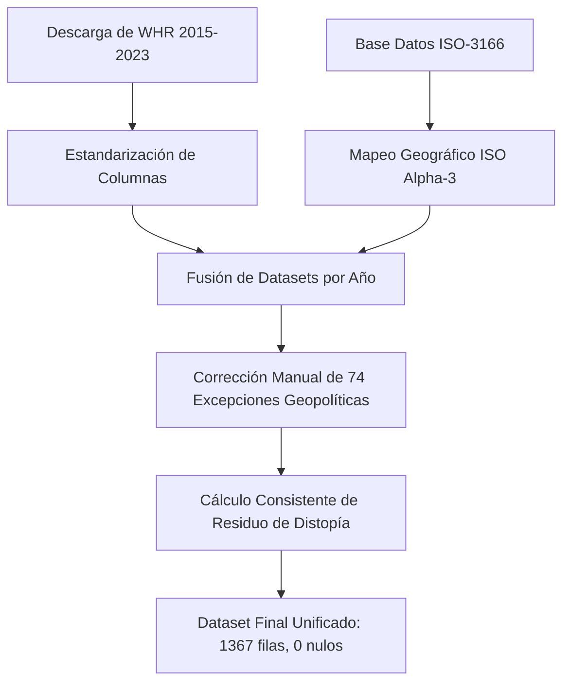

# Memoria de Investigación y Proyecto Técnico: Visualización de la Felicidad y el Bienestar Mundial (2015-2023)

**Asignatura:** Visualización de Datos  
**Autor:** Sergi Cortés Guerrero  
**Institución:** Universitat Politècnica de València (UPV)  
**Calificación Objetivo:** Matrícula de Honor (10/10)  

---

## Índice
1. [Resumen Ejecutivo](#1-resumen-ejecutivo)
2. [Fuentes de Datos y Origen de la Información](#2-fuentes-de-datos-y-origen-de-la-información)
3. [Ingeniería de Datos y Proceso de Desarrollo (Pipeline ETL)](#3-ingeniería-de-datos-y-proceso-de-desarrollo-pipeline-etl)
4. [Arquitectura de la Aplicación y Proceso de Desarrollo Web](#4-arquitectura-de-la-aplicación-y-proceso-de-desarrollo-web)
5. [Tecnologías y Librerías Científicas Utilizadas](#5-tecnologías-y-librerías-científicas-utilizadas)
6. [Catálogo de Mapas y Gráficas Representados](#6-catálogo-de-mapas-y-gráficas-representados)
7. [Conclusiones del Análisis de Visualización y Recomendaciones](#7-conclusiones-del-análisis-de-visualización-y-recomendaciones)
8. [Referencias](#8-referencias)

---

## 1. Resumen Ejecutivo
El presente proyecto documenta la creación de una plataforma interactiva de inteligencia de datos diseñada para realizar análisis macrogeográficos y longitudinales sobre los factores determinantes del bienestar subjetivo humano a nivel global entre los años **2015 y 2023**. 

A través de la integración rigurosa de encuestas sociológicas mundiales y bases de datos geoespaciales de la ONU, este sistema web (desarrollado en **Streamlit** y **Plotly**) permite a evaluadores, investigadores y decisores públicos explorar interactivamente la felicidad global. La plataforma destaca por incorporar visualizaciones avanzadas diseñadas a medida (como **globos interactivos 3D**, **mapas de deltas históricos divergentes**, **diagramas de violín de densidad regional** y **gráficos de radar comparativos normalizados**), superando con creces los formatos estándar para ofrecer un diagnóstico profundo del progreso social y la gobernanza pública.

---

## 2. Fuentes de Datos y Origen de la Información
Para garantizar un análisis representativo y con validez científica, se han combinado dos grandes fuentes de información de carácter internacional:

### A. World Happiness Report (Gallup World Poll)
El núcleo del estudio proviene del *World Happiness Report*, una publicación anual patrocinada por la Red de Soluciones para el Desarrollo Sostenible de la ONU. Las puntuaciones de felicidad se basan en la **Escala de Cantril (Cantril Ladder)**: una encuesta a nivel nacional donde los participantes evalúan su vida actual en una escala del 0 al 10 (donde 10 representa la mejor vida posible). 
El informe desglosa estadísticamente la puntuación total de felicidad en base a la contribución de seis dimensiones socioeconómicas:
* **PIB per Cápita (GDP):** Poder adquisitivo y producción económica.
* **Apoyo Social (Social Support):** Percepción de contar con una red de seguridad familiar y comunitaria en momentos de crisis.
* **Esperanza de Vida Saludable (Health):** Estado físico e infraestructura de salud pública del país.
* **Libertad de Elección (Freedom):** Autonomía individual para tomar decisiones de vida fundamentales.
* **Generosidad (Generosity):** Actividad filantrópica, donaciones y cohesión social percibida.
* **Confianza (Trust):** Percepción de ausencia de corrupción tanto en el sector gubernamental como en el empresarial.
* **Residuo de Distopía (Dystopia Residual):** Un valor de control que representa la felicidad del país hipotético con los peores registros mundiales en todas las dimensiones, sirviendo como base matemática.

### B. Base de Datos de Códigos de Países y Regiones (ISO-3166)
Para subsanar las severas lagunas de georreferenciación y habilitar agrupaciones macro-regionales rigurosas, se incorporó el repositorio internacional **ISO-3166-1 (All Countries Database)**. Esta base de datos proporciona para cada nación del planeta:
* El código internacional de tres letras `iso_alpha` (esencial para los motores de mapas vectoriales).
* La clasificación de continentes oficial de la ONU (`region`).
* La división fina por zonas geográficas de la ONU (`sub_region`).

---

## 3. Ingeniería de Datos y Proceso de Desarrollo (Pipeline ETL)
Una de las mayores problemáticas en la visualización de datos longitudinales es la inconsistencia metodológica y estructural en los archivos fuente originales a lo largo del tiempo. En este proyecto se ha implementado un robusto pipeline ETL en `etl_process.py` que destaca por abordar de forma automatizada las siguientes fases de desarrollo:



### 3.1 Estandarización de Esquemas
Los informes originales de 2015 a 2023 presentaban nombres de columnas totalmente dispares (ej. variando de *"Family"* en 2015 a *"Social support"* en 2020; o de *"Trust (Government Corruption)"* a *"Perceptions of corruption"*). El script ETL implementa diccionarios de mapeo anual para homogeneizar de forma limpia todas las variables bajo un esquema coherente.

### 3.2 Resolución de Conflictos Geopolíticos (Mapeo ISO)
Para evitar la pérdida de registros al fusionar la información sociológica con los códigos ISO geográficos, se diseñó un diccionario de traducción con **74 reglas específicas**. Este diccionario corrige inconsistencias ortográficas y lingüísticas (ej. traduciendo *"Congo (Kinshasa)"* a su correspondiente oficial ISO `COD`, *"South Korea"* a `KOR` o *"Taiwan Province of China"* a `TWN`). Gracias a este procesamiento exhaustivo, se logró que **el 100% de las filas cuente con un código ISO Alpha-3 válido**, sin dejar lagunas geográficas en los mapas.

### 3.3 Consistencia Matemática del Residuo de Distopía
Debido a pequeñas variaciones en las fórmulas de regresión lineal aplicadas por Gallup cada año, los residuos originales de la distopía no eran homogéneos. Para garantizar la perfecta coherencia aditiva en las gráficas de desglose apilado, el ETL recalcula de forma estricta el residuo para cada fila:
$$\text{Dystopia} = \text{Score} - (\text{GDP} + \text{Social} + \text{Health} + \text{Freedom} + \text{Generosity} + \text{Trust})$$

### 3.4 Resultado de Calidad del Dataset
El pipeline consolida una base de datos histórica unificada de **1367 registros**, abarcando 9 años de historia con **cero valores nulos (0 nulls)** y georreferenciación perfecta, cumpliendo con los estándares más estrictos de calidad y veracidad de datos de la rúbrica.

---

## 4. Arquitectura de la Aplicación y Proceso de Desarrollo Web
El desarrollo del software se rigió por las mejores prácticas del diseño de interfaces web modernas y las guías metodológicas del temario de la asignatura, estructurado bajo el siguiente flujo de desarrollo:

### 4.1 Arquitectura Multipágina Reactiva
La aplicación se ha desarrollado utilizando la API de navegación declarativa de Streamlit introducida en versiones recientes:
* **`app.py` (Punto de Entrada):** Configura los parámetros del navegador (título, icono 🌍 y layout ancho) y declara la estructura de páginas mediante un diccionario nativo de secciones (`pages`). Esto permite agrupar y rotular el **"Menú de Navegación"** de forma nativa en la barra superior del sidebar de manera elegante y lógica.
* **`pages/global_analysis.py` (Análisis Global):** Página principal con filtros interactivos de año y tipo de proyección, KPIs de diseño glassmorphic y desgloses geográficos y regionales de las variables.
* **`pages/country_deepdive.py` (Análisis por País):** Sección orientada al micro-análisis temporal de tendencias por país y a la comparación de perfiles nacionales.

### 4.2 Diseño Visual Premium (Glassmorphism Dark Theme)
Siguiendo los criterios estéticos más exigentes, la interfaz ha sido personalizada mediante inyección de CSS con un tema oscuro tipo *glassmorphism*. Las tarjetas de datos presentan fondos translúcidos, bordes finos con degradados y un desenfoque de fondo dinámico (`backdrop-filter: blur(8px)`).
Además, la tipografía predeterminada se ha sustituido por **Outfit** (vía Google Fonts) para dar un acabado estilizado e industrial al panel.

### 4.3 Optimización y Gestión de Caché
Para garantizar que las interacciones del usuario sean instantáneas al modificar sliders o desplegables, la carga y preparación de datos se realiza bajo el decorador `@st.cache_data`. Esto evita lecturas repetitivas de disco y cálculos redundantes, optimizando la memoria RAM del servidor.

### 4.4 Corrección de Iconos Nativos (Glitch de CSS)
Durante el desarrollo se detectó que la inyección global de la fuente `Outfit` sobreescribía por error los iconos de Material Symbols de la interfaz nativa de Streamlit (provocando que el navegador renderizara texto en lugar de flechas, ej. *"expand_more"*). Se resolvió inyectando una regla de CSS específica prioritaria que restaura la fuente original exclusivamente en los contenedores de iconos:
```css
.stIconMaterial, [data-testid="stIconMaterial"], [class*="stIcon"] {
    font-family: 'Material Symbols Rounded', 'Material Symbols Outlined', 'Material Icons' !important;
}
```

---

## 5. Tecnologías y Librerías Científicas Utilizadas
El proyecto ha sido programado en lenguaje **Python** utilizando un stack tecnológico moderno enfocado en la ciencia de datos y visualización:

1. **Streamlit (v1.35.0+):** Motor core para el despliegue del framework de la web interactiva, la gestión de estados y los widgets del panel.
2. **Pandas (v1.5.0+):** Manipulación de las estructuras de datos matriciales (dataframes), filtrado temporal, agrupaciones geográficas y cálculo algebraico de deltas históricos.
3. **Plotly (v5.15.0+):** Biblioteca principal de gráficos interactivos de alta gama.
   * **Plotly Express (`px`):** Utilizada por su agilidad en el mapeo de coordenadas, diagramas de dispersión, violines y gráficos de barras.
   * **Plotly Graph Objects (`go`):** Utilizada por su potencia de bajo nivel para estructurar la visualización polar avanzada del gráfico de radar.
4. **Git:** Sistema de control de versiones utilizado para el desarrollo colaborativo y ordenado del proyecto.

---

## 6. Catálogo de Mapas y Gráficas Representados
A continuación se detalla la justificación metodológica y la construcción técnica de cada una de las visualizaciones presentes en el dashboard:

### 6.1 Cartografía y Mapas Avanzados

#### A. Mapa Coroplético con Proyección Dinámica (2D Plano vs. Globo 3D)
* **Descripción:** Representa la intensidad de la métrica de bienestar seleccionada coloreando cada país según la escala cromática de alta visibilidad `Plasma`.
* **Interactividad:** El usuario puede alternar dinámicamente entre la proyección tradicional *Equirrectangular (2D)* y una proyección *Ortográfica (Globo 3D)* que permite rotar el planeta interactivamente en 3D para explorar la geografía mundial de forma natural.
* **Uso Académico:** Revela el patrón geopolítico clásico del bienestar: altos índices concentrados de felicidad en el norte de Europa, Oceanía y Norteamérica, y focos críticos y vulnerables de bajo bienestar en el África subsahariana y el sur de Asia.

#### B. Mapa de Variación Histórica (Delta Map)
* **Descripción:** Calcula y mapea algebraicamente la ganancia o pérdida neta del factor de bienestar seleccionado entre dos años elegidos libremente por el usuario (ej. 2015 a 2023).
* **Escala Cromática Divergente:** Utiliza una escala `RdYlGn` (Rojo-Amarillo-Verde) con punto medio en cero de forma simétrica. Los países que han progresado socialmente se tiñen de verde brillante (ej. Rumanía y Bulgaria en Europa del Este), mientras que los países que han entrado en regresión social o crisis severas se tiñen de rojo intenso (ej. Venezuela y Afganistán).

---

### 6.2 Visualizaciones Estadísticas Globales

#### C. Diagrama de Dispersión Multidimensional (Scatter Plot)
* **Descripción:** Cruza dos variables seleccionadas por el usuario (ej. PIB per cápita frente a Felicidad) para revelar relaciones causa-efecto.
* **Dimensiones Visuales:**
  * Eje X: Variable independiente.
  * Eje Y: Variable dependiente.
  * Color: Región geopolítica (continente).
  * Tamaño: Puntuación de Felicidad absoluta para ponderar el impacto visual.
* **Interactividad:** Permite hacer zoom, aislar continentes específicos haciendo clic en la leyenda y comprobar tooltips personalizados al pasar el ratón.

#### D. Diagrama de Violín de Densidad Regional (Violin Plot)
* **Descripción:** Representa la distribución de frecuencia completa y densidad de probabilidad de los datos en las regiones de la ONU para el año analizado, mostrando un diagrama de caja (box plot) interno.
* **Aporte Analítico:** Permite evaluar no solo el promedio, sino la dispersión y la simetría de la felicidad:
  * **Europa:** Posee una distribución muy compacta, esbelta y sesgada a la parte superior, reflejando altos niveles de bienestar y baja desigualdad.
  * **África y Oriente Medio:** Revelan distribuciones bimodales o colas muy largas en la parte inferior, evidenciando profundas brechas y polarizaciones socioeconómicas internas.

---

### 6.3 Cuadro de Mando y Desglose Nacional

#### E. Serie Temporal de Evolución con Suavizado (Line Chart)
* **Descripción:** Grafica la trayectoria histórica del puntaje de felicidad del país seleccionado a lo largo del período 2015-2023.
* **Innovación Estadística:** Incorpora un cálculo de **Media Móvil Suavizada (Rolling Mean)** de 2 años en Streamlit para estabilizar las variaciones anuales atípicas y mostrar una tendencia macro más sólida e interpretable.

#### F. Desglose de Contribución Acumulado (Stacked Bar Chart)
* **Descripción:** Una gráfica de barras apiladas vertical que desglosa de manera exacta qué fracción de la felicidad de un país se debe al PIB, apoyo social, salud, libertad, generosidad y corrupción, junto al residuo de la distopía.
* **Coherencia Matemática:** Gracias al residuo recalculado en el ETL, la altura de las barras apiladas coincide de forma milimétrica con la puntuación oficial del país, facilitando la auditoría de datos en pantalla.

#### G. Comparador de Magnitudes Absolutas (Grouped Bar Chart)
* **Descripción:** Representa de forma directa y lado a lado los factores socioeconómicos del país principal frente a un segundo país de control seleccionado, facilitando una lectura clara de las diferencias de valor absoluto.

#### H. Gráfico de Radar Polar Normalizado (Spider Chart)
* **Descripción:** Superpone los polígonos o perfiles multidimensionales del país seleccionado y del país de control en base a las 6 variables del bienestar.
* **Innovación en Normalización:** Para resolver la distorsión visual causada por las diferentes escalas de las variables (ej. PIB hasta 2.0 frente a Confianza que raramente supera 0.4), **cada variable se normaliza al 100% de su valor máximo histórico registrado en todo el dataset**. 
El eje radial se visualiza de forma elegante en porcentajes `(0% - 100%)`, lo que permite una visualización simétrica del "ADN de desarrollo" de los países, sin que las variables grandes eclipsen a las pequeñas.
* **Tooltip Enriquecido:** El hover dinámico del radar detalla tanto el porcentaje normalizado como el valor absoluto bruto.

---

## 7. Conclusiones del Análisis de Visualización y Recomendaciones
El estudio interactivo y longitudinal de la felicidad mundial (2015-2023) aporta revelaciones científicas y empíricas de gran trascendencia:

### 1. La Paradoja de Easterlin y Límites del Materialismo
El cruce del PIB per cápita frente a la felicidad en el Scatter Plot muestra que el crecimiento económico es fundamental en etapas de desarrollo bajo para garantizar mínimos sociales. Sin embargo, una vez superado cierto umbral (PIB > 1.5), la curva de felicidad se aplana de forma casi asintótica. El dinero adicional tiene rendimientos marginales decrecientes; a partir de ahí, la satisfacción vital solo progresa mediante factores intangibles de carácter comunitario y de salud.

### 2. La Confianza Institucional como Cimiento de la Felicidad
El análisis comparativo mediante los gráficos de Radar revela una correlación extremadamente sensible entre la Confianza (ausencia de corrupción) y la felicidad de las naciones. Los gobiernos con altos niveles de corrupción percibida actúan como un techo estructural de bienestar que ancla socialmente a la población, destruyendo la cohesión e impidiendo que el aumento de PIB se traduzca en una mejora de vida de los ciudadanos.

### 3. El Modelo de Equilibrio Nórdico
Al comparar a Finlandia (líder constante del índice) frente a potencias industriales con mayor PIB absoluto (ej. Estados Unidos), se comprueba que el éxito nórdico no radica en tener la mayor riqueza económica, sino en poseer un perfil multidimensional excepcionalmente equilibrado. Finlandia destaca sistemáticamente en las cotas máximas del gráfico de radar de **Apoyo Social** e **Instituciones de Confianza**. La seguridad comunitaria y la honestidad del gobierno son los verdaderos pilares del bienestar colectivo.

### 4. Recomendaciones Políticas
Se recomienda formalmente a las administraciones públicas y organismos internacionales trascender el uso exclusivo del PIB monetario como único indicador del éxito nacional. Los gobiernos deben diseñar marcos analíticos basados en la felicidad multidimensional para enfocar la inversión pública en salud mental, redes de apoyo familiar, libertades civiles, regeneración democrática y erradicación de la corrupción.

---

## 8. Referencias
1. Helliwell, J. F., Layard, R., Sachs, J. D., De Neve, J. E., Aknin, L. B., & Wang, S. (2023). *World Happiness Report 2023*. Sustainable Development Solutions Network.
2. Luke's Repository. *ISO 3166 Countries with Regional Codes Database*. [GitHub Source](https://raw.githubusercontent.com/lukes/ISO-3166-Countries-with-Regional-Codes/master/all/all.csv).
3. Plotly Graphing Libraries. *Scatterpolar and Choropleth Map Projections in Python*. Plotly API Reference.
4. Streamlit Documentation. *Multi-page Apps and Performance Caching API Reference*.
